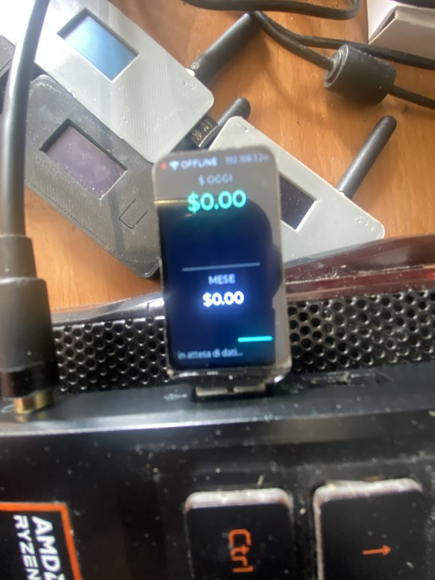
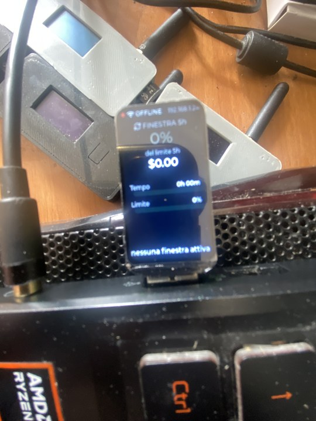
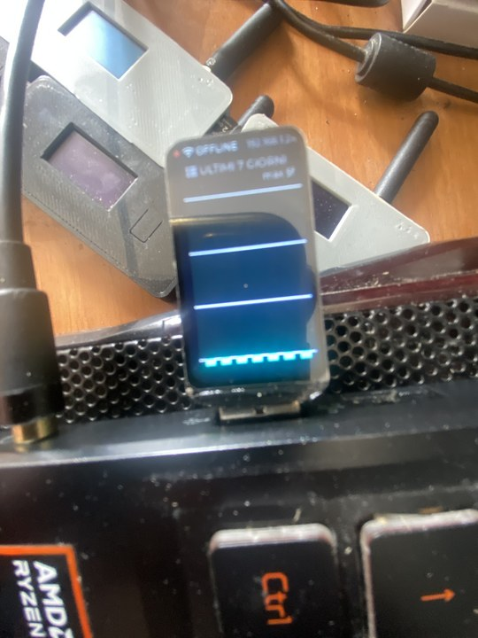
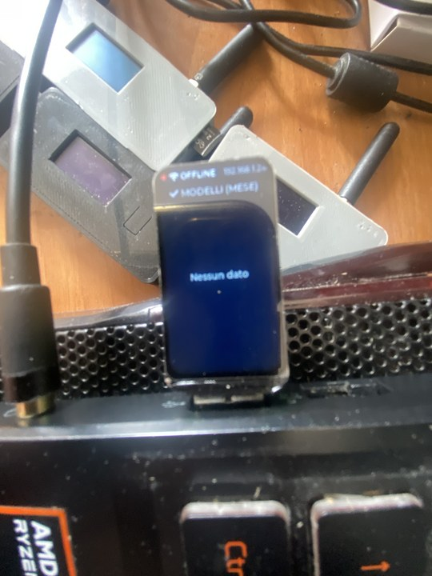

# Claude Code Usage Monitor — ESP32-S3 Ambient Display

> A small desktop ambient display that shows your **Claude Code** usage in real time:
> spend, tokens, 7-day history, per-model breakdown, and — most importantly — the
> current **5-hour rate-limit window** with countdown to reset, mirroring what
> `claude.ai → Settings → Usage` shows you.


---

## Why

Claude Code (Pro / Max 5x / Max 20x) limits aren't a flat monthly bill — they're
a rolling **5-hour window** that resets 5h after your first message in that
window, plus a weekly cap. Knowing how much of that window you've burned is
useful for pacing your work, but checking the Anthropic dashboard requires
opening a browser. This project puts that number on a small dedicated screen
on your desk.

The transcript files Claude Code writes locally to `~/.claude/projects/` contain
all the data we need (`message.usage`, model, timestamps). A tiny Python bridge
parses them and exposes a JSON endpoint; the ESP32-S3 firmware polls it over
WiFi and renders four LVGL views on a 172×320 TFT.

## Features

- **5-hour window tracker** with countdown — closely matches the official
  Anthropic dashboard (within a few percent / few minutes).
- **Cost views**: today + yesterday + 7-day sparkline trend, this month, full
  7-day bar chart, top-N model breakdown.
- **Dual progress bars on the 5h tab**: time elapsed (purple) and limit
  used (green→amber→red), so the two axes never get confused.
- **ETA-to-limit projection** — extrapolates when you'd hit the cap at the
  current burn rate; turns red under 30 minutes.
- **Plan-aware**: pick `pro` / `max5` / `max20` or set a custom limit.
- **Pricing configurable** via `pricing.json` (USD per million tokens).
- **No cloud dependency**: bridge reads local transcript files; nothing leaves
  your LAN.
- **Secured by default** (v0.2): bearer-token auth on `/usage` and `/metrics`,
  token generated on first run and persisted with mode 0600.
- **Prometheus `/metrics` endpoint** for Grafana scraping.
- **Captive portal provisioning** (v0.2): no recompile to change WiFi /
  bridge / token — first boot or BOOT-button reset opens a setup AP.
- **BOOT button gestures**: tap = next tab, long-press = toggle auto-rotate,
  very-long-press = reset NVS.
- **Robust**: dedup by `message.id` (Claude Code rewrites the same assistant
  message multiple times during tool calls — naive parsers count it 2-5×);
  anchors window start on the first `user` message (matching Anthropic's
  request-time accounting, not completion-time).
- **Auto-reconnect WiFi**, **OFFLINE indicator**, **last value persists** on
  bridge outage. Persistent WiFi failure falls back into setup AP.
- ~33 % RAM, ~19 % flash on ESP32-S3 (8 MB PSRAM, 16 MB flash).

## Hardware

This firmware targets the [**Waveshare ESP32-S3-LCD-1.47**](https://www.waveshare.com/wiki/ESP32-S3-LCD-1.47)
dev board:

| | |
|---|---|
| SoC      | ESP32-S3R8 (Xtensa LX7 dual-core 240 MHz) |
| Memory   | 512 KB SRAM, 8 MB OPI PSRAM, 16 MB flash |
| Display  | 1.47" TFT ST7789, 172×320, 262K colors, SPI |
| Wireless | WiFi 2.4 GHz, BLE 5 |
| RGB LED  | WS2812-compatible on GPIO 38 (status indicator) |
| USB      | Native USB CDC/JTAG (no extra serial chip) |

Should adapt to other ESP32-S3 boards with an ST7789 by tweaking pins in
`firmware/src/Display_ST7789.h`.

## Display in action

Real photos from a running v0.2 board (1.47" ST7789, the device is normally
held with the USB connector to one side — 320×172 effective landscape).
These were taken in OFFLINE state so the values show `$0.00` / `0%` and the
status bar reads `OFFLINE` — the point is the layout, not the data.

| Costo | Finestra 5h |
|:---:|:---:|
|  |  |
| `$ OGGI` headline + `MESE` + `in attesa di dati` footer | `0%` headline + `Tempo` (violet) + `Limite` (green→amber→red) bars + status text |

| Ultimi 7 giorni | Modelli (Mese) |
|:---:|:---:|
|  |  |
| `ULTIMI 7 GIORNI` with auto-scaled bars | `MODELLI (MESE)` — empty here ("Nessun dato"), normally lists top 5 |

Status bar at the top is always visible (`WIFI ONLINE` / `WIFI OFFLINE` with
status dot + bridge endpoint), and the onboard RGB LED mirrors connection
state.

The four views auto-rotate every 6 seconds (you can also navigate manually
via the BOOT button — see *Captive portal & button* below):

1. **Costo** — `OGGI $X` (large, green) above a sparkline of the last 7 days,
   `ieri $Y` line, divider, `MESE $Z`, and `updated Xs ago` footer.
2. **Finestra 5h** *(the important one)* — current usage of the 5-hour
   rolling rate-limit window:
   - Big percentage label (green / amber / red at 70 % / 90 % thresholds).
   - `$cost / $plan_limit` and `N msg | out tokens` compact line.
   - **Two labeled bars**: `Tempo` (violet, 0–300 min elapsed) and `Limite`
     (green→amber→red, 0–100 % of plan limit).
   - **ETA-to-limit** (when burning at non-trivial rate): amber under 60 min,
     red under 30 min. Hidden when the window won't actually hit the cap.
   - `reset tra Xh Ym` countdown at the bottom.
3. **Ultimi 7 giorni** — bar chart of daily cost over the past week,
   auto-scaled, today is the rightmost bar.
4. **Modelli (mese)** — top 5 models for the month with cost and a
   proportional cyan bar.

The status bar shows a colored dot (green ONLINE / red OFFLINE) + `WIFI`
icon + status text + the ESP32's LAN IP. The onboard RGB LED on GPIO 38
mirrors that state and flashes purple on each successful poll. In setup
mode (captive portal) the LED is steady blue.

## Quick start

> **Platform support**: developed and tested on **Linux**. The bridge uses
> only the Python 3.10+ standard library and PlatformIO is cross-platform,
> so the project is designed to work on **Windows and macOS** as well — the
> only differences are firewall config, the Python launcher (`py` vs
> `python3`), and serial port naming (`COMx` vs `/dev/ttyACM0`). See the
> per-step OS notes below.

### 1. Run the bridge on your computer

```bash
git clone https://github.com/rootedlab-code/claude-code-usage-monitor
cd claude-code-usage-monitor/bridge
```

| OS | Command |
|---|---|
| Linux / macOS | `python3 bridge.py --plan max5` |
| Windows (PowerShell or cmd) | `py bridge.py --plan max5` |

Output (write down the **IP** and **token** — you'll paste them into the
ESP32 setup form):

```
Claude Code Usage Bridge avviato
  ascolta su:   http://0.0.0.0:8787
  IP locale:    http://192.168.1.42:8787/usage
  budget mese:  500.00 USD
  limite 5h:    200.00 USD (max5)
  ...
  auth:         bearer (token persistito in ~/.claude-code-usage/token)
  token:        aBcDeFgHiJkLmN...rStUvWxYz
  short:        aBcD...wXYz
```

Sanity check it works:

```bash
TOK=$(cat ~/.claude-code-usage/token)
curl -s -H "Authorization: Bearer $TOK" http://localhost:8787/usage | python3 -m json.tool
curl -s http://localhost:8787/health    # /health stays anonymous
```

Want unauthenticated like v0.1? Use `--no-auth` (warning printed; only for
trusted local testing). The token is regenerated automatically if you delete
`~/.claude-code-usage/token`.

> The bridge reads `~/.claude/projects/**/*.jsonl` via `pathlib.Path.home()`,
> which resolves to `/home/<user>/...` on Linux/macOS and
> `C:\Users\<user>\...` on Windows. No code change needed.

### 2. Open the firewall

The ESP32 needs to reach your computer on port 8787.

**Linux:**
```bash
sudo iptables -I INPUT -p tcp --dport 8787 -j ACCEPT
# or for ufw:     sudo ufw allow 8787/tcp
# or firewalld:   sudo firewall-cmd --add-port=8787/tcp
```

**macOS:** the built-in Application Firewall does not block inbound TCP for
local Python processes by default. If it prompts you, click "Allow".

**Windows** (run as Administrator):
```powershell
netsh advfirewall firewall add rule name="Claude Bridge" dir=in action=allow protocol=TCP localport=8787
```

### 3. Build and flash the firmware

Install [PlatformIO Core](https://platformio.org/install/cli) (recommended)
or the [PlatformIO VS Code extension](https://platformio.org/install/ide?install=vscode).
Both work on Windows, Linux, and macOS.

```bash
cd ../firmware
```

Create your `secrets.h` — you can leave **all values empty** for v0.2 since
the captive portal handles them at runtime, or fill them in for a fully
compile-time config:

| OS | Command |
|---|---|
| Linux / macOS | `cp src/secrets.h.template src/secrets.h` |
| Windows (cmd) | `copy src\secrets.h.template src\secrets.h` |
| Windows (PowerShell) | `Copy-Item src\secrets.h.template src\secrets.h` |

Then build and flash:

```bash
pio run -t upload
pio device monitor        # 115200 baud
```

> On Windows the ESP32-S3 appears as `COM3`, `COM4`, etc. — `pio` auto-detects
> it. The native USB-CDC driver is included in Windows 10/11; no extra driver
> needed.

If the upload fails: hold **BOOT**, tap **RESET**, release **RESET**, release
**BOOT** to enter download mode, then retry.

### 4. Provision the device (captive portal)

If you left `secrets.h` empty, the device boots into setup mode:

1. The display shows `Modalità Setup` + AP name `ClaudeMonitor-XXYY` + the
   URL `http://192.168.4.1`.
2. On your phone, join the open `ClaudeMonitor-XXYY` network.
3. Most OS show a captive-portal notification automatically; otherwise open
   `http://192.168.4.1` in any browser.
4. Pick your WiFi from the scan dropdown, paste the **bridge IP** and
   **token** from step 1, hit *Salva e collegati*.
5. The device reboots, connects, polls the bridge.

To re-enter setup later: **hold BOOT for >5 seconds** while the device is
running. NVS is wiped and you're back at the AP form.

### 5. Watch the display

Boot order: a 2-second splash ("Claude Code Usage v0.2.0") with state line,
WiFi connect (~1–3 s), first bridge fetch — total **~5–10 seconds** until
numbers populate. The status dot goes green and the RGB LED blinks purple on
each successful poll. Use BOOT button gestures to navigate manually (see
*Captive portal & button* below).

## Configuration

### Bridge CLI flags

| Flag             | Default     | Description                                          |
|------------------|-------------|------------------------------------------------------|
| `--host`         | `0.0.0.0`   | Bind address                                         |
| `--port`         | `8787`      | TCP port                                             |
| `--plan`         | `max5`      | `pro` / `max5` / `max20` — sets 5h window limit      |
| `--plan-limit`   | (from plan) | Override 5h limit in USD                             |
| `--budget`       | `500`       | Monthly budget in USD (informative, used in mese)    |
| `--ttl`          | `2.0`       | In-memory cache TTL in seconds                       |
| `--token`        | (auto)      | Override bearer token (skip auto-generate/persist)   |
| `--no-auth`      | off         | Disable auth (warning printed). Don't do this on hostile LANs. |
| `--metrics-anon` | off         | Allow `/metrics` without auth (for Prometheus)       |

The defaults match Claude **Max 5x**. Override with `--plan max20` or
`--plan-limit 250` for a custom subscription.

### Plan presets (estimated 5h cost-equivalent limits)

| Plan           | Monthly | 5h limit (USD equiv) |
|----------------|---------|----------------------|
| Pro            | $20     | ~$40                 |
| Max 5x         | $100    | ~$200                |
| Max 20x        | $200    | ~$1000               |

These are *estimates* of what Anthropic's internal limit translates to in
API-equivalent dollars. They give a good visual indicator but won't be
exact to the percent; adjust `--plan-limit` if your dashboard shows a
consistent offset.

### Custom pricing

Edit `bridge/pricing.json` (USD per million tokens). Models are matched by
prefix, so `claude-opus-4-7-20251201` falls back to `claude-opus-4-7`. The
`_default` entry is used for unknown models.

### Auto-start the bridge

**Linux (systemd user service):**

```ini
# ~/.config/systemd/user/claude-bridge.service
[Unit]
Description=Claude Code Usage Bridge

[Service]
ExecStart=/usr/bin/python3 %h/path/to/claude-code-usage-monitor/bridge/bridge.py --plan max5
Restart=on-failure

[Install]
WantedBy=default.target
```

```bash
systemctl --user enable --now claude-bridge.service
```

**macOS (launchd):** create `~/Library/LaunchAgents/com.user.claude-bridge.plist`
with a `ProgramArguments` array pointing at `python3` + the script path, then
`launchctl load ~/Library/LaunchAgents/com.user.claude-bridge.plist`.

**Windows (Task Scheduler):**
```powershell
$action  = New-ScheduledTaskAction -Execute "py" -Argument "C:\path\to\claude-code-usage-monitor\bridge\bridge.py --plan max5"
$trigger = New-ScheduledTaskTrigger -AtLogOn
Register-ScheduledTask -TaskName "ClaudeBridge" -Action $action -Trigger $trigger -RunLevel Limited
```
Or place a `claude-bridge.bat` shortcut in `shell:startup` (`Win+R` → `shell:startup`).

## Captive portal & button reference

### Captive portal triggers

| Trigger | Effect |
|---|---|
| Empty NVS **and** empty `secrets.h` at boot | AP `ClaudeMonitor-XXYY` opens, display shows setup screen |
| Hold **BOOT** for >5 s while running | NVS is cleared, device reboots into setup |
| WiFi STA fails 3× within 30 s | Drops into AP automatically (typical for wrong password or router off) |

### BOOT button gestures (runtime)

| Gesture | Duration | Action |
|---|---|---|
| Tap | <500 ms | Next tab; auto-rotate paused 30 s |
| Long press | 500 ms – 5 s | Toggle auto-rotate (persisted to NVS) |
| Very long press | >5 s | Reset NVS → reboot → captive portal |

> Why polling and not interrupts? GPIO 0 is also the ESP32-S3 strap pin for
> ROM download mode. An ISR is sampled at unfortunate moments during reset/wake.
> Polling sidesteps this entirely.

> "Hold BOOT at power-on to force setup" is **not** a primary path — holding
> BOOT during reset puts the chip in download mode instead of running our
> firmware. Use the runtime very-long-press, or simply clear `secrets.h`.

## Security

See [SECURITY.md](SECURITY.md) for the full threat model. TL;DR: the bridge
ships with bearer-token auth on `/usage` and `/metrics` (token at
`~/.claude-code-usage/token` with mode 0600). Trust boundary is the **LAN**;
do not expose the bridge to the Internet without TLS in front (e.g.,
nginx/Caddy). Report vulnerabilities to **rootedlab@proton.me**.

## How it works

### Bridge

1. Walks `~/.claude/projects/**/*.jsonl` on every request (cached 2 s in RAM).
2. For each `type:"assistant"` row with `message.usage`:
   - **Dedup by `message.id`** — Claude Code rewrites the same message 2-5
     times in a single JSONL during tool-call iterations. Counting each
     occurrence would inflate totals by ~3×.
   - Compute cost via prefix-matched pricing × `(input + output + cache_*)`.
3. For the 5h window:
   - Collect timestamps of **both** `user` and `assistant` events from the
     last 10h (anchor points).
   - Walk them chronologically; whenever the current timestamp is more than
     5h after the active window start, open a new window.
   - The last `window_start` is the active session. `reset_at = start + 5h`.
   - Sum cost / tokens / messages of assistant events ≥ `window_start`.
4. Serve at `GET /usage` (JSON).

### Firmware

- **`Config`** — runtime config in NVS via `Preferences` (namespace
  `cc-monitor`). Reads on boot, falls back to `secrets.h` defines when keys
  are empty — so source builds keep working without setup AP. Persists
  WiFi creds, bridge host/port/token, poll interval, auto-rotate preference.
- **`Portal`** — captive portal for first-boot provisioning: `WiFi.softAP`
  named `ClaudeMonitor-XXYY` (last 4 hex of MAC), `DNSServer` catch-all to
  `192.168.4.1`, `WebServer` serving a small HTML form (`/`, `/scan`,
  `/save`). 302-redirect on `onNotFound` triggers the captive popup on iOS,
  Android, and modern Windows.
- **`Wireless`** — WiFi STA mode with `WiFiEvent` auto-reconnect plus a
  persistent-failure counter (3 disconnects in 30 s without a recovery
  triggers a drop into portal mode).
- **`Button`** — debounced state machine for the BOOT button (GPIO 0,
  polled, never via ISR because GPIO 0 doubles as the ROM-bootloader strap).
  Emits `TAP` / `LONG` / `VERY_LONG` events.
- **`UsageClient`** — FreeRTOS task pinned to core 0, polls the bridge every
  N ms (default 5 s) via `HTTPClient` with `Authorization: Bearer <token>`,
  parses with `ArduinoJson` v7, stores in a shared struct guarded by
  `xSemaphoreCreateMutex()`. Logs 401 explicitly when the token is wrong.
- **`UsageUI`** — LVGL 8.3 on core 1. Boot splash, 4 main panels swapped
  with `lv_obj_fade_in/out` (180/200 ms transitions, one-shot timers for
  the hide step), portal full-screen overlay, toast helper, status bar.
  UI refresh from the snapshot runs every 400 ms in `loop()`.
- **`Display_ST7789`** — original Waveshare driver, patched for both
  arduino-esp32 2.0.x and 3.x LEDC APIs (backlight PWM).

## Project structure

```
claude-code-usage-monitor/
├── LICENSE                        GPL v3
├── README.md                      this file
├── SECURITY.md                    threat model + disclosure contact (v0.2)
├── CHANGELOG.md                   keep-a-changelog (v0.2)
├── CONTRIBUTING.md                contributor guide (v0.2)
├── .github/                       issue templates + CI workflow (v0.2)
├── .gitignore
│
├── bridge/                        Python — runs on your PC
│   ├── bridge.py                  HTTP server + JSONL parser + bearer auth
│   ├── pricing.json               editable model price table
│   └── README.md
│
├── firmware/                      ESP32-S3 — PlatformIO project
│   ├── platformio.ini
│   ├── README.md
│   └── src/
│       ├── main.cpp               setup() + loop() + boot flow
│       ├── secrets.h.template     fallback config (captive portal is primary path)
│       ├── lv_conf.h              LVGL config (Montserrat 22/28/32 enabled)
│       ├── Display_ST7789.{cpp,h} ST7789 SPI driver
│       ├── LVGL_Driver.{cpp,h}    LVGL init / flush callback
│       ├── RGB_lamp.{cpp,h}       NeoPixel driver (status LED)
│       ├── Wireless.{cpp,h}       WiFi STA + reconnect + fail counter
│       ├── UsageClient.{cpp,h}    HTTP polling task + JSON parsing + auth header
│       ├── UsageUI.{cpp,h}        LVGL UI: splash, 4 panels, portal, toast (v0.2)
│       ├── Config.{cpp,h}         NVS-backed runtime config (v0.2)
│       ├── Portal.{cpp,h}         softAP captive portal + DNSServer + WebServer (v0.2)
│       └── Button.{cpp,h}         BOOT button debounced state machine (v0.2)
│
├── docs/
│   └── hardware/                  pin maps, reference notes
│
├── ESP32-S3-LCD-1.47-Demo/        upstream Waveshare demo (reference)
└── 1.47inch_LCD_Datasheet.pdf     ST7789 datasheet
```

## Troubleshooting

| Symptom                                | Likely cause / fix                                              |
|----------------------------------------|-----------------------------------------------------------------|
| `[UsageClient] HTTP 401`               | Token mismatch. Re-paste the bridge token via captive portal, or check `BRIDGE_TOKEN` in `secrets.h`. |
| `[UsageClient] HTTP -1` repeating      | Firewall on host. Open port 8787 (see Quick Start §2).          |
| Status bar stuck on OFFLINE            | Wrong bridge host; bridge not running; AP isolation on WiFi router |
| Device boots into setup mode unexpectedly | WiFi creds wrong or router off (3× retry → portal). Hold BOOT >5s to wipe NVS and re-provision. |
| WiFi never connects                    | Re-check SSID/password. 5 GHz-only networks unsupported.        |
| Build error `ledcAttach not declared`  | arduino-esp32 2.0.x — guard already in code, ensure you're on PIO `espressif32 ≥ 6.x` |
| `PIN_NEOPIXEL redefined`               | Old core. Confirm `RGB_LED_PIN` is used (not `PIN_NEOPIXEL`).   |
| Bridge shows costs ~3× too high        | You're on an older bridge.py without dedup. Pull latest.        |
| 5h window % diverges from dashboard    | Tune `--plan-limit` to match your subscription's real cap.      |
| Upload fails / can't find /dev/ttyACM0 | Hold BOOT, tap RESET, release RESET, release BOOT.              |
| Can't reach captive portal AP          | Make sure your phone joined `ClaudeMonitor-XXYY`; manually open `http://192.168.4.1`. |

## Building from scratch (Arduino IDE alternative)

PlatformIO is recommended but the project also builds in Arduino IDE 2.x:

1. Install **esp32 by Espressif Systems** ≥ 3.0.2 from Boards Manager.
2. Copy `ESP32-S3-LCD-1.47-Demo/Arduino/libraries/{lvgl,PNGdec}` to
   `~/Arduino/libraries/`.
3. Install **ArduinoJson** ≥ 7.0.0 from Library Manager.
4. Rename `firmware/src/main.cpp` → `firmware/firmware.ino` (or create a
   folder `firmware/firmware/firmware.ino` matching IDE conventions).
5. Board: **ESP32S3 Dev Module**. Settings:
   - USB CDC On Boot: Enabled
   - Flash Size: 16 MB
   - PSRAM: OPI PSRAM
   - Partition Scheme: 16M Flash (3MB APP / 9.9MB FATFS)

## Contributing

See [CONTRIBUTING.md](CONTRIBUTING.md) for the contributor guide and
[CHANGELOG.md](CHANGELOG.md) for release notes.

A few ideas the project hasn't tackled yet:

- mDNS discovery so the bridge host can be `claude-bridge.local` instead of an IP.
- TLS on the bridge (v0.3): self-signed cert + WiFiClientSecure on the ESP32.
- Weekly limit indicator (Anthropic dashboard exposes both 5h *and* weekly).
- Port to other ESP32-S3 boards (T-Display-S3, M5StickC, etc).
- Cost calculation refinement (1h-ephemeral cache pricing, server tool use,
  thinking tokens, ...).
- BLE-based provisioning as an alternative to softAP captive portal.

When contributing, please run the bridge once with your own transcripts and
include the corrected output in the PR description if the change affects
parsing/cost.

## Acknowledgements

- **[Waveshare](https://www.waveshare.com/wiki/ESP32-S3-LCD-1.47)** — board,
  reference schematics, original demos.
- **[LVGL](https://lvgl.io/)** — light-weight graphics library powering the UI.
- **[ArduinoJson](https://arduinojson.org/)** — JSON parsing on the MCU.
- **[Anthropic](https://www.anthropic.com/)** — Claude Code and the API model
  that makes this useful.

## License

This project is licensed under the **GNU General Public License v3.0**.
See [LICENSE](LICENSE) for the full text. In short: you're free to use,
modify, and redistribute it, but derivative works must remain GPL-licensed
and provide source.

The upstream Waveshare demo files under `ESP32-S3-LCD-1.47-Demo/` retain
their original licenses (typically MIT/BSD, see individual headers).
